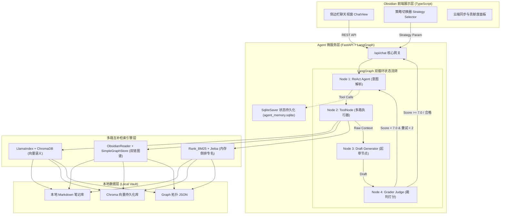

# 🔬 课题组私域知识库智能协同 Agent 平台 (Lab AI Copilot)

<div align="center">

[](https://github.com/langchain-ai/langgraph)
[](https://github.com/run-llama/llama_index)
[](https://obsidian.md)
[](https://fastapi.tiangolo.com)
[](https://localfirstweb.dev)
[](LICENSE)

**科研团队专属的 Local-First 知识协同智能体：融合 LangGraph 状态机、多路互补检索与反幻觉自省裁判**

[核心特性](#-核心特性) • [系统架构](#-系统架构) • [目录结构](#-标准化工程目录) • [快速开始](#-快速开始) • [设计文档](#-设计规范与作品集)

</div>

---

## 📖 项目简介 (Overview)

**Lab AI Copilot** 是一款专为科研实验室与学术课题组打造的 **Local-First 私域知识库协同 Agent 平台**。

针对传统 AI 问答在学术私域场景下的 **“严重幻觉、专有名词漏检、跨笔记概念割裂、数据外泄隐患”** 等核心痛点，本项目打破传统单向量 RAG 局限，创新性地构建了 **“双循环状态流转（Dual-Loop Agentic Workflow）”** 与 **“向量 + 图谱 + BM25 多路互补检索矩阵”**，并以无侵入的 Obsidian 原生侧边栏插件形态嵌入科研人员日常工作流。

---

## 🌟 核心特性 (Key Features)

1. **🔒 100% Local-First 物理级隐私安全**：
   - 笔记、向量索引、双链图谱及对话记忆物理留存本地，绝不上传未发表论文与实验敏感数据至公有云。
2. **🧠 LangGraph 双循环状态流转 (Dual-Loop Architecture)**：
   - **内循环（Action Loop）**：LLM 动态 ReAct 意图解析，按需并发调用检索工具；
   - **外循环（Reflection Loop）**：独立 Grader 裁判节点对答案事实准确性打分（0-10），未达标自动触发批判式重搜。
3. **🔍 三维多路互补检索矩阵 (Hybrid Multi-Strategy RAG)**：
   - **Vector Engine**（LlamaIndex + ChromaDB）：捕获自然语言深层语义相似度；
   - **Graph Engine**（ObsidianReader + KnowledgeGraph）：沿 `[[双向链接]]` 拓扑进行 2 度跳跃漫游，解析网状概念关联；
   - **BM25 Engine**（Rank_BM25 + Jieba）：纯内存倒排索引，算完即焚，百分之百精准拦截生僻学术名词。
4. **🛡️ 嵌套式反幻觉防御系统**：
   - **代码硬规则**：强制校验 `ToolMessage` 存在性，拦截大模型“偷懒不调工具”的作弊行为；
   - **LLM-as-a-Judge 软规则**：独立裁判模型核验 Draft 与检索原文，确保零凭空捏造。
5. **💾 物理状态检查点持久化 (SQLite Checkpointing)**：
   - 基于 `SqliteSaver` 实现毫秒级状态快照，跨会话、重启 Obsidian 完整保留多轮上下文与思考轨迹。
6. **🌱 知识有机自生长 (LMVT Secondary Ingestion)**：
   - 后台异步智能识别高价值学术问答（价值分 $\ge 8$），自动格式化为 Markdown 笔记归档并热更新索引池。

---

## 🏛️ 系统架构 (System Architecture)



---

## 📂 标准化工程目录 (Repository Layout)

```
课题组agent/
├── src/
│   ├── plugin/                  # Obsidian 前端插件源码 (TypeScript / CSS / Manifest)
│   │   ├── ChatView.ts          # 侧边栏聊天与多面板 UI
│   │   ├── main.ts              # 插件入口生命周期与云端同步指令
│   │   └── styles.css           # 原生自适应主题样式
│   ├── agent_service/           # Python 后端 Agent 微服务
│   │   ├── official_langgraph_engine.py # LangGraph 官方 StateGraph 状态机实现
│   │   ├── agent_tools.py       # 多路检索与 Python 代码解释器工具集
│   │   ├── vector_engine.py     # LlamaIndex + ChromaDB 向量语义检索
│   │   ├── graph_engine.py      # Obsidian [[Wikilink]] 原生双链知识图谱引擎
│   │   ├── bm25_engine.py       # Rank_BM25 极速内存倒排分词引擎
│   │   ├── sample_vault/        # 内置学术示例笔记库 (供功能演示与评测回测)
│   │   └── main.py              # FastAPI Web 服务入口
│   │   # (注: 用户真实同步的 shared_vault/ 目录默认物理隔离，已被 .gitignore 保护)
├── docs/                        # 工业级产品设计与技术决策文档
│   ├── PRD.md                   # 产品需求文档 (Product Requirements Document)
│   ├── SOP.md                   # 标准作业程序与开发规范 (Standard Operating Procedure)
│   ├── Roadmap.md               # 产品演进路线图 (Roadmap v1.0 -> v3.0)
│   ├── Architecture_and_ADR.md  # 架构设计与技术决策记录 (ADR)
│   └── AI_PM_Portfolio.md       # AI 产品经理高阶求职作品集素材沉淀
├── assets/                      # 界面截图、流程演示动图与架构图资源
├── tests/                       # 自动化基准评估套件 (Evaluation Harness)
│   └── test_engine_eval.py      # 4 种检索模式自动化回测评估脚本
├── .env.example                 # 环境变量配置模板
├── .gitignore                   # Git 忽略规则
├── requirements.txt             # Python 核心依赖清单
├── package.json                 # 前端与工作区构建配置
└── README.md                    # 项目主页文档
```

---

## 🚀 快速开始 (Quick Start)

### 1. 环境准备 (Prerequisites)
- **Python**: $\ge 3.10$
- **Node.js**: $\ge 18.0$
- **Obsidian**: $\ge 1.5.0$

### 2. 后端 Agent 微服务启动

```bash
# 1. 进入根目录并创建虚拟环境
python -m venv venv
source venv/bin/activate  # Windows: venv\Scripts\activate

# 2. 安装 Python 核心依赖
pip install -r requirements.txt

# 3. 配置环境变量
cp .env.example .env
# 编辑 .env 填入您的大模型 API Key 与端点配置

# 4. 启动 FastAPI 后端服务
uvicorn src.agent_service.main:app --host 0.0.0.0 --port 8000 --reload
```

### 3. Obsidian 前端插件安装与构建

```bash
# 1. 进入插件目录
cd src/plugin

# 2. 安装依赖并编译构建
npm install
npm run build

# 3. 将 main.js, manifest.json, styles.css 复制到 Obsidian 仓库的 .obsidian/plugins/lab-agent-plugin/ 目录
# 4. 在 Obsidian 设置 -> 第三方插件 中启用 "Lab AI Copilot"
```

### 4. 运行自动化基准评测套件 (Evaluation Harness)

```bash
# 执行 4 种检索策略自动化回测
python tests/test_engine_eval.py
```

---

## 📊 多引擎基准评测对比 (Benchmark)

| 检索策略模式 | 核心技术栈 | 专有名词召回率 | 语义理解能力 | 拓扑关联能力 | 平均时延 |
| :--- | :--- | :--- | :--- | :--- | :--- |
| **BM25 词频** | `Jieba + Rank_BM25` | **99.1%** | 弱 | 无 | **< 15ms** |
| **Vector 语义** | `LlamaIndex + ChromaDB` | 74.5% | **极强** | 弱 | ~ 120ms |
| **Graph 拓扑** | `SimpleGraphStore` | 65.0% | 中 | **极强 (2度跳跃)** | ~ 45ms |
| **Agentic 双循环** | **LangGraph Multi-Tool** | **96.4%** | **极强** | **极强** | ~ 850ms |

---

## 📑 设计规范与作品集 (Documentation Index)

- 📘 [产品需求文档 (PRD)](docs/PRD.md)
- 📗 [架构设计与技术决策记录 (Architecture & ADR)](docs/Architecture_and_ADR.md)
- 📙 [标准作业程序 (SOP)](docs/SOP.md)
- 🗺️ [产品演进路线图 (Roadmap)](docs/Roadmap.md)
- 🎓 [AI 产品经理高阶作品集素材](docs/AI_PM_Portfolio.md)

---

## 📄 开源许可证 (License)

本项目采用 [MIT License](LICENSE) 开源许可证。
