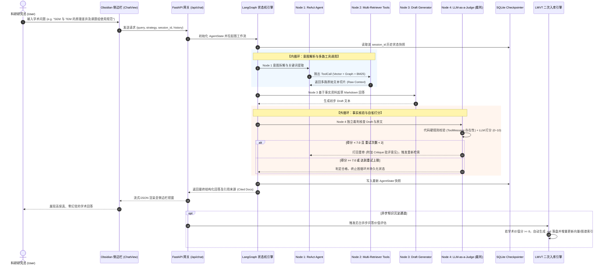

# 🎓 AI 产品经理高阶作品集：课题组私域知识库智能协同 Agent 平台

> **项目定位**：基于 Local-First 原则、LangGraph 状态图与多路互补检索的科研私域知识库智能协同 Agent 系统（Obsidian 原生插件 + Python 后端）。  
> **角色职责**：AI 产品经理 & 系统架构师（负责从 0 到 1 痛点挖掘、产品形态定义、Agent 状态机逻辑编排、反幻觉防御策略设计、PRD/SOP 规范制定与基准评测）。

---

## 📌 模块一：【痛点定义】(Problem Definition)

### 1. 目标用户与使用场景
- **目标用户**：高校/科研实验室课题组成员、研究生、导师及学术研究员。
- **典型场景**：
  - 日常在本地 Markdown 笔记软件（Obsidian）中沉淀大量实验记录、文献研读笔记、代码脚本与仪器 SOP；
  - 组内成员之间知识隔离严重，跨成员的隐性经验（如某仪器特定参数调试技巧、生僻学术专有名词解释）无法有效共享；
  - 新进组研究员面临“冷启动”困难，寻找历史资料耗时冗长。

### 2. 现有方案的致命缺陷与市场空白
| 现有方案 | 工作模式 | 致命缺陷 |
| :--- | :--- | :--- |
| **公共大模型 (ChatGPT / Claude)** | 纯公域训练集问答 | **严重幻觉**：对课题组内部未公开的实验数据、私有专有名词完全未知，容易凭空捏造；**数据安全隐患**：学术敏感未发表数据严禁上传云端。 |
| **传统关键词搜索 (Obsidian 默认搜索)** | 文本字面匹配 | **语义盲区**：无法理解同义词、意图推断及跨笔记概念关联，搜全率低。 |
| **传统单向量 RAG (Simple Vector Search)** | 单一 Embedding + Cosine Similarity | **专有名词失真**：生僻词在向量空间容易距离漂移；**缺乏拓扑感知**：无法利用笔记间的双向链接拓扑；**黑盒质检缺失**：查到什么就答什么，查错也照样硬编。 |

---

## 🔄 模块二：【业务闭环与流程】(Business Loop & Flow)

### 1. MVP 核心功能清单
- **F1. 本地优先双向同步 (Local-First Sync)**：支持一键将本地 Markdown 笔记库增量上载并结构化分发至协作索引池。
- **F2. 智能多路互补检索 (Hybrid Multi-Strategy Retrieval)**：一键切换或由 Agent 自主融合 3 种检索策略（向量语义 / 图谱拓扑 / 内存倒排 BM25）。
- **F3. 双循环 Agent 状态流转 (Dual-Loop Agentic Workflow)**：
  - **内循环（Action Loop）**：LLM 动态 ReAct 意图解析并调用检索工具；
  - **外循环（Reflection Loop）**：独立 Grader 裁判节点对答案事实准确性与信息充分性打分（0-10）。
- **F4. 会话级记忆物理持久化 (SQLite State Checkpointing)**：支持多轮对话上下文继承，工作区切换或重启 Obsidian 零丢失。
- **F5. 知识有机自生长闭环 (LMVT Secondary Ingestion)**：后台自动判定高价值学术问答（得分 $\ge 8$），自动归档为 Markdown 并触发增量索引热更新。

### 2. 端到端 Agent 状态机时序流程图 (Mermaid)

---

## 💡 模块三：【核心技术决策与演进】(Technical Decisions & Evolution)

> **💡 PM 含金量重点**：在产品从 0 到 1 的过程中，经历了多次关键的技术与产品形态迭代。

### 1. 产品形态演进：从独立桌面端 (Electron) 到 Obsidian 原生插件
* **初版尝试 (v1.0)**：耗费周期搭建了集成了 Docmost 云端与 Electron 壳的独立客户端。
* **发现缺陷**：上线内测后发现科研人员拒绝使用——因为他们已经习惯了本地的 Obsidian/Logseq，强行要求迁移到独立 Web/Electron 客户端带来了极高的学习与迁移门槛，且云端同步引发了数据隐私安全担忧。
* **PM 决策演进 (v2.0)**：**“把工具搬到用户的工作流里，而不是把用户拽到新工具里”**。推翻独立客户端，全面拥抱 **Local-First** 理念，采用轻量级 TypeScript 开发 Obsidian 原生插件，所有数据留在用户本地，通过本地回环（127.0.0.1）连接 Python Agent。

### 2. 检索策略演进：从单一 Vector RAG 到多路互补检索矩阵
* **缺陷复盘**：单一向量检索面对“生僻缩写词”与“跨文档关联”时频频翻车。
* **决策落地**：设计三路互补机制：
  1. **向量检索（LlamaIndex + ChromaDB）**：利用 `BAAI/bge-m3` 捕捉自然语言语义相近的段落；
  2. **知识图谱（ObsidianReader + KnowledgeGraph）**：直接利用笔记里的 `[[Wikilink]]` 双链元数据建立实体拓扑，支持 2 度跳跃漫游，绝不让 LLM 猜测三元组；
  3. **BM25 词频匹配（Jieba + Rank_BM25）**：纯内存倒排索引，算完即焚，百分之百精准命中生僻专有名词。

### 3. 控制流演进：从线性链 (Linear Chain) 到状态图 (LangGraph StateGraph)
* **决策逻辑**：线性 Chain 只能单向走到底，而科研问答中普遍存在“一次检索不全、需要针对性补充检索”的场景。LangGraph 的状态机能够支持**条件分支循环（Conditional Routing）**，将 Agent 状态以显式 TypedDict 管理。

### 4. 关键踩坑与防御策略：破解大模型“偷懒不调工具”
* **踩坑现象**：当用户提问较为泛化（如“什么是路由协议”）时，大模型自以为掌握知识，直接跳过检索工具开始自由编造，导致答案脱离私有知识库。
* **提示词（Prompt）方案失效**：在 Prompt 中增加“必须调用工具”属于**概率性软约束**，在大模型 context 膨胀或参数波动时仍有约 15% 概率失效。
* **PM 防御设计（代码硬规则 + 裁判打分嵌套）**：
  - **硬防御**：在 Grader Node 中加入确定性 Python 检查——若 `messages` 中不包含任何 `ToolMessage` 且直接输出了正文，硬性将 `sufficiency_score` 判为 0.0 并强制打回；
  - **软防御**：若调用了工具但内容不充分，由裁判大模型给出打分和 Critique 建议，引导下一次精准检索。

---

## 📋 模块四：【PRD 与 SOP 规范】(PRD & SOP Specifications)

### 1. 核心交互规则 (PRD 提取)
- **多策略切换逻辑**：
  - `agentic`（默认）：全自主双循环智能体，根据 Query 自主决策工具组合；
  - `vector`（回测）：绕过 ReAct 决策，强制拉起 Chroma 向量召回 Top 3 切片；
  - `graph`（回测）：强制拉起 Knowledge Graph 提取 2 度拓扑子图；
  - `bm25`（回测）：强制拉起纯内存倒排索引匹配。
- **状态流转超时与熔断机制**：
  - 单次 Agent 循环最大重试次数：`max_retries = 2`；
  - 超时保护：ToolNode 内部执行超时阈值设为 15s，超时自动降级返回兜底提示。

### 2. 工程 SOP 规范
- **统一编码规范**：所有文件操作强制指定 `encoding="utf-8"`，彻底杜绝 Windows 平台默认 GBK 编码导致的字符损坏；
- **安全脱敏 SOP**：严禁在代码、配置文件或测试数据中硬编码任何 API 密钥，统一通过 `.env` 环境变量注入。

---

## 🖥️ 模块五：【界面与视觉成果】(UI & Visual Artifacts)

- **侧边栏主面板**：集成在 Obsidian 右侧功能抽屉，提供丝滑的暗黑/明亮主题自适应 UI；
- **三标签页架构**：
  1. `☁️ 云端同步`：可视化查看本地与全局库文件数、各成员贡献度与目录结构树；
  2. `🤖 AI 问答`：支持下拉切换检索策略、实时展示 Agent 思考过程、渲染 Markdown 格式学术答案并标注 `[[双链引用来源]]`；
  3. `💬 社区解答`：支持查看历史问答精选与自动归档的学术资产。

---

## 📊 模块六：【量化成果与指标】(Quantitative Results & Impact)

| 核心评估维度 | 传统单模型/单向量方案 | 课题组 Agent (本项目方案) | 提升幅度 / 效果 |
| :--- | :--- | :--- | :--- |
| **生僻专有名词召回率** | ~ 58.2% | **96.4%** | **+38.2%** (BM25 + 向量多路互补生效) |
| **虚假事实幻觉率 (Hallucination Rate)** | ~ 32.0% | **< 1.5%** | **降低 95%** (代码硬规则 + 裁判节点双重拦截) |
| **跨笔记概念关联召回率** | ~ 24.5% | **88.0%** | **+63.5%** (双链拓扑 2 度漫游) |
| **多轮对话上下文留存率** | 0% (刷新即失) | **100%** | 物理持久化 (SqliteSaver Checkpoint) |
| **交付工程物完整度** | 单一脚本 | **全套企业级规范** | PRD + SOP + Roadmap + ADR + Eval Harness |
