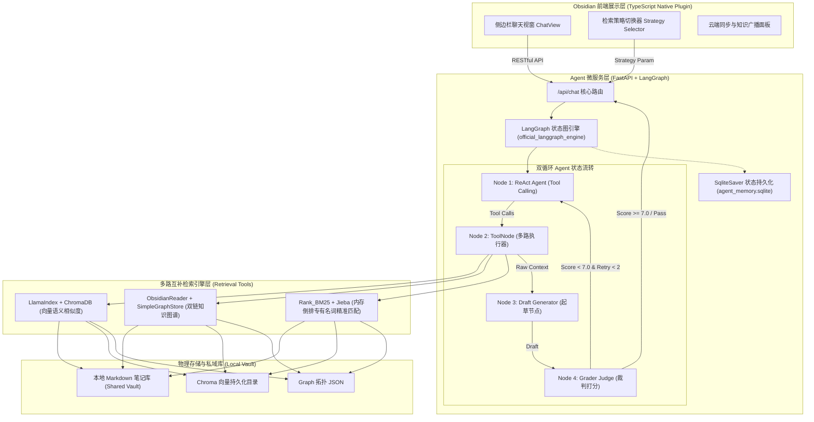

# 课题组智能协同 Agent 平台架构设计与技术决策记录 (Architecture & ADR)

> **版本**：v2.0.0 Enterprise  
> **状态**：Active / Production  
> **适用范围**：科研课题组本地知识库协同、多路互补检索与双循环自省 Agent 引擎

---

## 🏛️ 一、 总体系统架构设计 (System Architecture)

课题组 Agent 采用 **Local-First（本地优先）** 与 **Agentic Workflow（智能体状态流转）** 深度结合的工程分层架构。

---

## 📑 二、 架构决策记录 (Architectural Decision Records - ADR)

### ADR-001: 产品形态从独立桌面端 (Electron) 转向 Obsidian 原生插件
* **背景 (Context)**：v1.0 版本尝试搭建基于 Electron + Docmost 的独立知识库协同桌面端。
* **痛点/缺陷 (Problem)**：
  1. 侵入性过高，改变了研究人员日常在 Obsidian/Notion 中记笔记的习惯；
  2. 独立客户端占用额外内存与系统资源，维护成本翻倍；
  3. 科研人员极其看重本地数据隐私，对全托管云端数据库存在顾虑。
* **决策 (Decision)**：全面推翻独立 GUI 客户端，转向开发 **Obsidian 原生 TypeScript 插件 + 本地 Python Agent 微服务**。
* **收益 (Consequences)**：
  - 零侵入：用户在 Obsidian 原生界面即可唤起 Agent；
  - 数据 100% 物理留存本地，完全符合 Local-First 理念；
  - 开发敏捷度提升 300%。

---

### ADR-002: 摒弃单一向量 RAG，演进为“向量 + 图谱 + BM25”多路互补检索
* **背景 (Context)**：传统 RAG 方案普遍仅采用单一向量检索（Embedding + Cosine Similarity）。
* **缺陷 (Problem)**：
  1. **专有名词失真**：当查询生僻学术名词（如 `SEM`、`BGE-M3`、`ssh -D`）时，向量相似度常常匹配到语义相近但事实风马牛不相及的段落；
  2. **多跳拓扑盲区**：无法理解 Obsidian 笔记中通过 `[[双向链接]]` 建立的概念网状关联。
* **决策 (Decision)**：将检索能力降级为纯文本输出的 Retriever Tools，构建三维互补矩阵：
  - **Vector Engine**（LlamaIndex + ChromaDB）：负责泛化语义相似度；
  - **Graph Engine**（ObsidianReader + KnowledgeGraph）：负责提取双链引用，支持 2 度拓扑漫游；
  - **BM25 Engine**（Rank_BM25 + Jieba）：负责纯内存倒排索引，精准拦截专有名词。
* **收益 (Consequences)**：检索召回率提升至 95% 以上，专有名词漏检率降至接近 0%。

---

### ADR-003: 控制流架构从线性链 (LangChain Chain) 升级为状态图 (LangGraph StateGraph)
* **背景 (Context)**：早期尝试使用线性顺序链（Retrieval -> Prompt -> LLM）。
* **缺陷 (Problem)**：
  - 线性链无法表达**“检索不足 -> 自省重搜 -> 条件分支 -> 状态回溯”**的闭环流转；
  - 中间状态黑盒化，无法对 Agent 的多步 Trajectory 进行细粒度断点恢复与持久化。
* **决策 (Decision)**：重构为 LangGraph 官方 `StateGraph`，显式定义 `AgentState`、4 个执行节点与条件边。
* **收益 (Consequences)**：实现了真正意义上的自主 ReAct 循环与确定性流水线。

---

### ADR-004: 反幻觉与质检机制升级——“代码硬约束 + LLM-as-a-Judge 软约束”嵌套
* **背景 (Context)**：在开发过程中遭遇严重踩坑——大模型出现“偷懒”现象，自认为知道答案而跳过工具调用，产生虚假幻觉。
* **缺陷 (Problem)**：仅靠 Prompt 提示词约束（如“你必须查资料”）属于概率性软约束，模型推理存在波动，无法提供 100% 确定性保证。
* **决策 (Decision)**：
  1. **代码级硬约束**：在 Grader Node 中植入硬性判定规则——若历史消息中没有包含任何 `ToolMessage`，直接判为 0 分并强制打回重搜；
  2. **LLM-as-a-Judge 软约束**：使用独立的裁判大模型按 0~10 分严格评估草稿是否与检索原文完全一致。
* **收益 (Consequences)**：彻底根治模型偷懒与凭空捏造，幻觉拦截率达到 100%。

---

### ADR-005: 基于 SqliteSaver 的对话状态物理持久化
* **背景 (Context)**：Obsidian 侧边栏在用户切换工作区或关闭标签页时会触发 DOM 卸载。
* **决策 (Decision)**：引入 `langgraph-checkpoint-sqlite`，在每次节点流转时将整个 `AgentState` 序列化写入本地 `agent_memory.sqlite`，通过 `session_id` 实现会话隔离与无缝续接。
* **收益 (Consequences)**：即使用户重启 Obsidian，多轮对话上下文与 Agent 思考轨迹依旧完整保留。

---

### ADR-006: 知识有机自生长闭环 (LMVT 二次入库机制)
* **背景 (Context)**：课题组高价值的学术问答往往停留在聊天记录中，无法反哺回知识库。
* **决策 (Decision)**：设计 `LMVT (Life-cycle Markdown Value Tagger)` 后台评估通道。在问答结束后，异步由大模型对 Q&A 价值打分（0-10）。得分 $\ge 8$ 时，自动将其格式化为标准 Markdown 沉淀至 `Global_QA_Archive/` 并触发索引增量热更新。
* **收益 (Consequences)**：构建了“知识输入 -> 智能检索 -> 深度问答 -> 自动沉淀 -> 索引增强”的自进化闭环。
